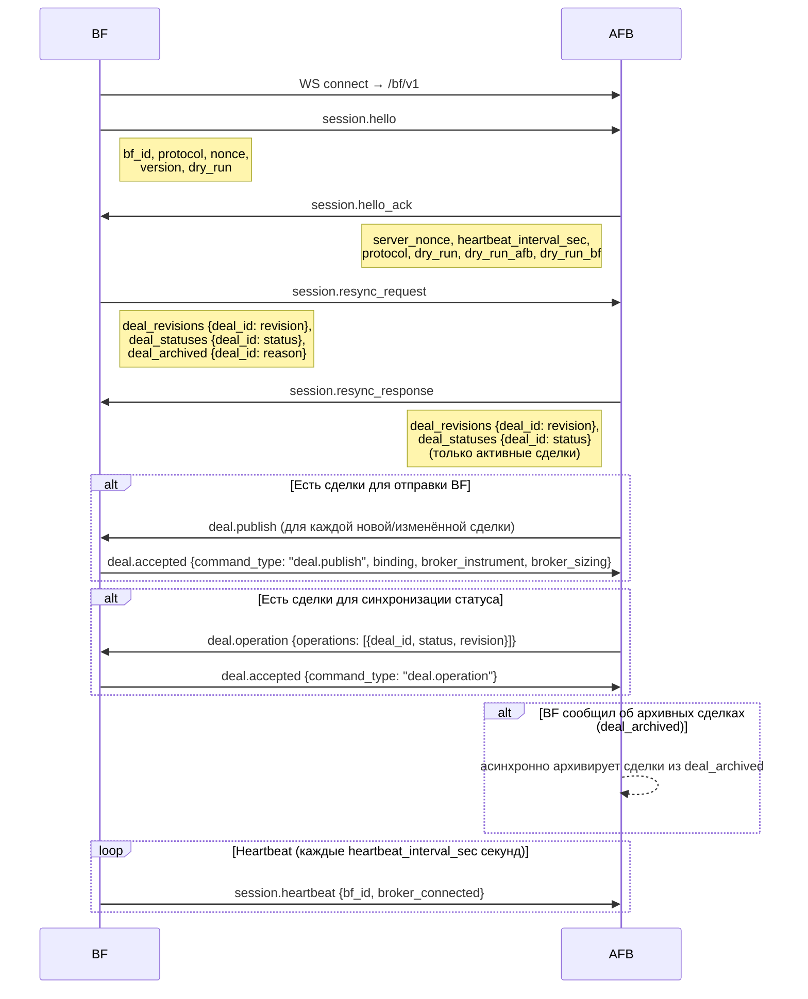
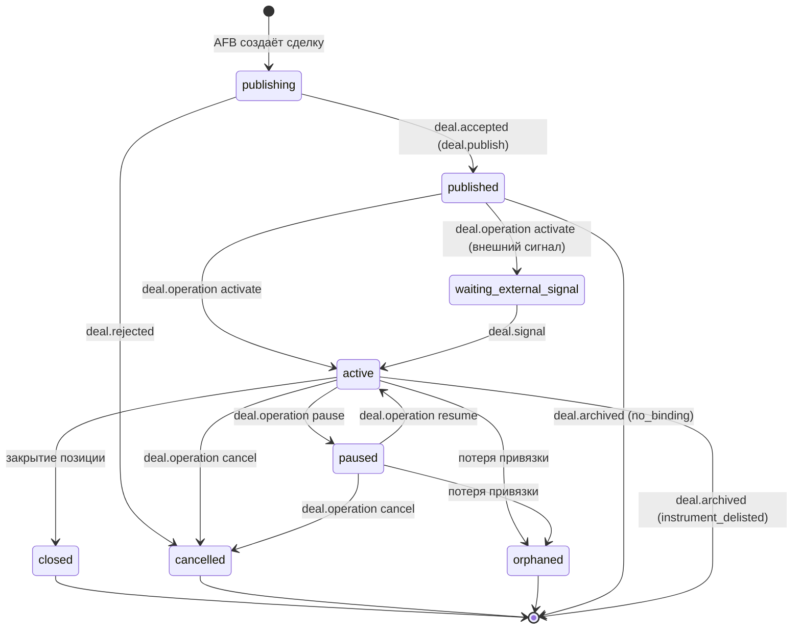

# Протокол взаимодействия AFB ↔ BF (afb.execution.v1)

## Обзор

**AFB** (OMS, сервер) — хранит сделки, принимает WS-подключения от BF.  
**BF** (Belphegor, исполнитель) — подключается к AFB, исполняет сделки через брокерский API.

Каждое сообщение — подписанный JSON-конверт (`spec/schemas/envelope.json`, подпись Ed25519).
Транспорт: WebSocket, BF подключается к AFB на `ws://<host>/bf/v1`.

---

## 1. Начальное рукопожатие (Handshake)



### Детали шагов

| Шаг | Отправитель | Тип | Ключевые поля payload |
|-----|-------------|-----|-----------------------|
| 1 | BF | `session.hello` | `bf_id`, `protocol`, `nonce`, `dry_run` |
| 2 | AFB | `session.hello_ack` | `server_nonce`, `heartbeat_interval_sec`, `dry_run`, `dry_run_afb`, `dry_run_bf` |
| 3 | BF | `session.resync_request` | `deal_revisions`, `deal_statuses`, `deal_archived` |
| 4 | AFB | `session.resync_response` | `deal_revisions`, `deal_statuses` (только активные) |
| 5+ | AFB | `deal.publish` / `deal.operation` | при необходимости досинхронизации |

`dry_run` в `hello_ack` — это `dry_run_afb OR dry_run_bf`; BF использует это значение для всей сессии.

---

## 2. Resync: алгоритм выравнивания инвентаря

BF посылает `session.resync_request` после каждого переподключения.

```
deal_revisions  — {deal_id: revision}  все активные сделки на BF
deal_statuses   — {deal_id: status}    статусы активных сделок на BF
deal_archived   — {deal_id: reason}    сделки, заархивированные на BF
                                        пока не было связи с AFB
```

AFB сравнивает инвентарь BF с хранилищем и принимает решение для каждой сделки:

| Условие | Действие AFB |
|---------|--------------|
| Сделка есть на BF, нет в AFB | `none` — BF ведёт её самостоятельно |
| Ревизия и статус совпадают | `none` — синхронизировано |
| Статус отличается, ревизия совпадает | `status_sync` → `deal.operation` |
| Ревизия отличается, BF-статус `published`/`cancelled` | `publish` → `deal.publish` |
| Ревизия отличается, BF-статус активный/паузированный | `ignore_unsafe_revision` — не трогаем |
| deal_id присутствует в `deal_archived` | исключается из resync_response, архивируется на AFB |

---

## 3. Жизненный цикл сделки



### Статусы

| Статус | Где | Значение |
|--------|-----|----------|
| `publishing` | AFB | сделка создана, ожидаем принятия BF |
| `published` | BF/AFB | BF принял, ждёт активации |
| `waiting_external_signal` | BF/AFB | ждёт внешнего сигнала на вход |
| `active` | BF/AFB | сделка активна, BF исполняет |
| `paused` | BF/AFB | исполнение приостановлено |
| `closed` | BF/AFB | позиция закрыта штатно |
| `cancelled` | BF/AFB | сделка отменена |
| `orphaned` | BF/AFB | потеряна брокерская привязка |

---

## 4. Команды AFB → BF и ответы BF

### 4.1 `deal.publish` — публикация сделки

**AFB → BF:**
```json
{ "deal": { /* afb.deal.v1 или afb.deal.v2 */ } }
```

**BF → AFB (успех):** `deal.accepted`
```json
{
  "command_type": "deal.publish",
  "deal_id": "deal-xxx:bf-id",
  "revision": 1,
  "binding": { "account_id": "...", "symbol": "ALRS@MISX" },
  "broker_instrument": { /* параметры инструмента от брокера */ },
  "broker_sizing": { "lots": 185, "required_cash": "4713.8", ... }
}
```

**BF → AFB (ошибка):** `deal.rejected`
```json
{
  "command_type": "deal.publish",
  "deal_id": "deal-xxx:bf-id",
  "code": "broker_grpc",
  "message": "Security not found"
}
```

---

### 4.2 `deal.operation` — операции над сделкой

**AFB → BF:**
```json
{
  "operations": [
    { "deal_id": "deal-xxx:bf-id", "op": "activate", "revision": 1 }
  ]
}
```

Допустимые `op`:

| op | Требуемый статус | Результат | Примечание |
|----|-----------------|-----------|------------|
| `activate` | `published` | `active` / `waiting_external_signal` | запускает исполнение |
| `pause` | `active` | `paused` | приостанавливает новые ордера |
| `resume` | `paused` | `active` | возобновляет |
| `cancel` | `active`, `paused` | `cancelled` | отменяет ордера и позицию |
| `reconcile` | `published`, `active`, `paused`, `orphaned` | — | пересверка с брокером |
| `delete` | `published`, `cancelled`, `closed`, `orphaned` | — | удаление с BF |
| `status` | любой | — | принудительная установка статуса (resync) |

**BF → AFB (успех):** `deal.accepted`
```json
{ "command_type": "deal.operation", "deal_id": "deal-xxx:bf-id" }
```

**BF → AFB (ошибка):** `deal.rejected`

---

### 4.3 `deal.resync` — полная пересинхронизация сделок

**AFB → BF:** массив сделок с актуальными данными и статусами.

```json
{
  "deals": [
    {
      "deal_id": "deal-xxx:bf-id",
      "revision": 3,
      "status": "active",
      "deal": { /* afb.deal.v2 */ },
      "status_history": [...],
      "source_refs": {}
    }
  ]
}
```

**BF → AFB:** `deal.accepted` с `command_type: "deal.resync"`.

---

### 4.4 `deal.signal` — внешний сигнал на вход

**AFB → BF:**
```json
{ "deal_id": "deal-xxx:bf-id" }
```

Переводит сделку из `waiting_external_signal` → `active`.  
**BF → AFB:** `deal.accepted` с `command_type: "deal.signal"`.

---

### 4.5 Broker-запросы (парные команды)

| Команда AFB → BF | Ответ BF → AFB | Описание |
|------------------|----------------|----------|
| `broker.get_account` | `broker.account` | баланс и параметры счёта |
| `broker.get_orders` | `broker.orders` | список активных ордеров |
| `broker.get_catalog` | `broker.catalog` | инструменты биржи/рынка |
| `broker.get_instrument` | `broker.instrument` | параметры конкретного инструмента |
| `broker.resolve_instrument` | `broker.instrument_resolved` | резолюция инструмента для сделки |

Все запросы используют `idempotency_key` и `correlation_id` для сопоставления ответа с запросом.

---

### 4.6 `daemon.capabilities_query` / `daemon.restart`

| Команда | Ответ | Описание |
|---------|-------|----------|
| `daemon.capabilities_query` | `daemon.capabilities` | возможности брокерского адаптера |
| `daemon.restart` | — (BF перезапускается) | перезапуск BF-демона |

---

## 5. События BF → AFB (без запроса)

### 5.1 Торговые события сделки

Все торговые события несут `deal_id`, `revision` и записываются в `trading_events` журнал BF.

| Событие | Payload | Когда |
|---------|---------|-------|
| `deal.status_changed` | `deal_id`, `status`, `revision`, `execution_phase`, `last_price` | смена статуса сделки |
| `deal.archived` | `deal_id`, `revision`, `reason`, `archived_at` | сделка удалена с BF |
| `deal.orders_synced` | `deal_id`, ордера | синхронизация списка ордеров |
| `deal.positions_synced` | `deal_id`, позиции | синхронизация позиций |
| `deal.report` | `deal_id`, итоговые данные | закрытие сделки |

Причины архивации (`deal.archived.reason`):

| reason | Что произошло |
|--------|---------------|
| `no_binding` | сделка принята BF, но брокерская привязка не установлена |
| `instrument_delisted` | инструмент исчез из брокерского каталога |
| `user_delete` | пользователь удалил сделку через AFB |

### 5.2 Торговые события ордеров и позиций

| Событие | Когда |
|---------|-------|
| `condition.triggered` | условие входа/выхода сработало |
| `order.created` | ордер выставлен брокеру |
| `order.partially_filled` | частичное исполнение |
| `order.filled` | полное исполнение |
| `order.cancelled` | ордер отменён |
| `order.rejected` | ордер отклонён брокером |
| `position.opened` | позиция открыта |
| `position.changed` | размер позиции изменился |
| `position.closed` | позиция закрыта |

### 5.3 Системные события

| Событие | Когда |
|---------|-------|
| `session.heartbeat` | каждые `heartbeat_interval_sec` секунд |
| `daemon.status` | изменение состояния BF-демона |
| `daemon.capabilities` | ответ на `daemon.capabilities_query` |
| `daemon.error` | критическая ошибка в BF |

---

## 6. Конверт и подпись

Каждое сообщение обёрнуто в стандартный конверт (`spec/schemas/envelope.json`):

```json
{
  "protocol": "afb.execution.v1",
  "message_id": "<uuid4>",
  "correlation_id": "<uuid4 | null>",
  "causation_id": "<uuid4 | null>",
  "sender": "<bf_id | afb>",
  "recipient": "<bf_id | afb>",
  "type": "<message type>",
  "created_at": "<ISO 8601>",
  "expires_at": "<ISO 8601>",
  "idempotency_key": "<string>",
  "payload_hash": "<sha256 hex>",
  "payload": { /* тип-специфичный объект */ },
  "signature": { "alg": "Ed25519", "key_id": "...", "value": "<base64url>" }
}
```

- `correlation_id` — заполняется ответчиком: берётся `message_id` запроса, к которому относится ответ.
- `idempotency_key` — гарантия at-most-once обработки на принимающей стороне.
- `payload_hash` — SHA-256 от канонической строки подписи (отдельно от конверта).

Подпись покрывает: `message_id`, `sender`, `recipient`, `type`, `created_at`, `expires_at`, `idempotency_key`, `payload_hash`.

---

## 7. Схема correlation_id для парных сообщений

```
BF           correlation_id = null
  → AFB:  session.resync_request (message_id = "AAA")

AFB          correlation_id = "AAA"  (ссылается на запрос BF)
  → BF:   session.resync_response

AFB          correlation_id = null
  → BF:   deal.publish (message_id = "BBB")

BF           correlation_id = "BBB"  (ссылается на команду AFB)
  → AFB:  deal.accepted / deal.rejected
```

---

## 8. Идемпотентность

`idempotency_key` формируется по правилу `<sender>:<type>:<uuid>`. BF дедуплицирует входящие команды и при повторной доставке отвечает кешированным ответом, не выполняя операцию снова. TTL кеша настраивается (по умолчанию 600 сек).

---

## 9. Связанные файлы

| Файл | Содержимое |
|------|-----------|
| `spec/asyncapi.yaml` | Полная AsyncAPI-спека всех сообщений |
| `docs/MESSAGES.md` | Каталог сообщений (генерируется из asyncapi.yaml) |
| `spec/schemas/envelope.json` | JSON Schema конверта |
| `spec/schemas/deal.v1.json` | Схема сделки v1 (одна точка входа/выхода) |
| `spec/schemas/deal.v2.json` | Схема сделки v2 (множество точек входа/выхода) |
| `spec/schemas/payloads/` | JSON Schema каждого payload |
| `examples/` | Подписанные примеры конвертов |
| `python/afb_bf_protocol/` | Python-пакет: модели, подпись, валидация |
