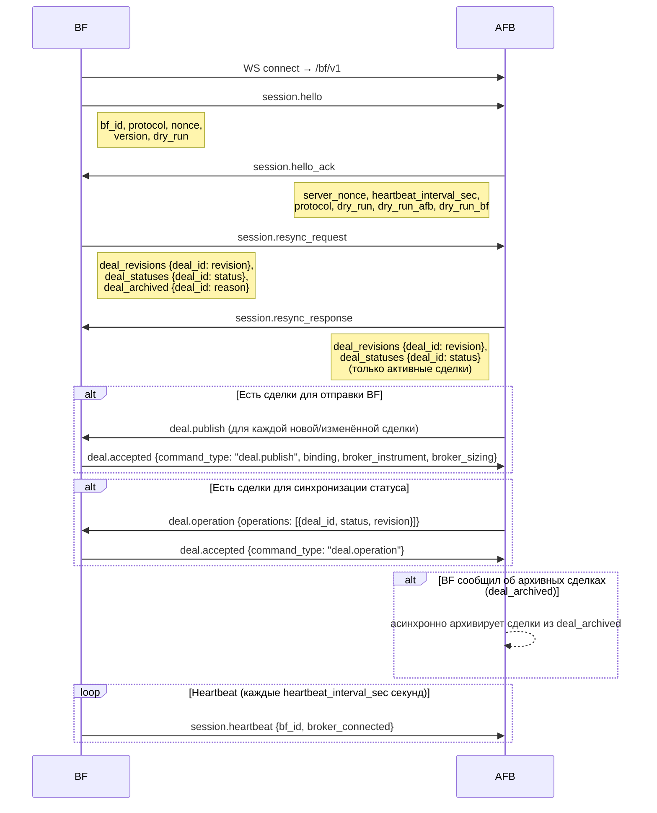
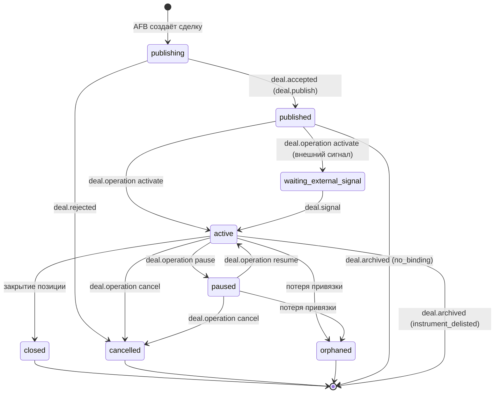

# Протокол взаимодействия AFB ↔ BF (afb.execution.v1)

## Обзор

**AFB** (OMS, сервер) — хранит сделки, принимает WS-подключения от BF.  
**BF** (Belphegor, исполнитель) — подключается к AFB, исполняет сделки через брокерский API.

Каждое сообщение — подписанный JSON-конверт (`spec/schemas/envelope.json`, подпись Ed25519).
Транспорт: WebSocket, BF подключается к AFB на `ws://<host>/bf/v1`.

---

## 1. Начальное рукопожатие (Handshake)



### Детали шагов

| Шаг | Отправитель | Тип | Ключевые поля payload |
|-----|-------------|-----|-----------------------|
| 1 | BF | `session.hello` | `bf_id`, `protocol`, `nonce`, `dry_run` |
| 2 | AFB | `session.hello_ack` | `server_nonce`, `heartbeat_interval_sec`, `dry_run`, `dry_run_afb`, `dry_run_bf` |
| 3 | BF | `session.resync_request` | `deal_revisions`, `deal_statuses`, `deal_archived` |
| 4 | AFB | `session.resync_response` | `deal_revisions`, `deal_statuses` (только активные) |
| 5+ | AFB | `deal.publish` / `deal.operation` | при необходимости досинхронизации |

`dry_run` в `hello_ack` — это `dry_run_afb OR dry_run_bf`; BF использует это значение для всей сессии.

---

## 2. Resync: алгоритм выравнивания инвентаря

BF посылает `session.resync_request` после каждого переподключения.

```
deal_revisions  — {deal_id: revision}  все активные сделки на BF
deal_statuses   — {deal_id: status}    статусы активных сделок на BF
deal_archived   — {deal_id: reason}    сделки, заархивированные на BF
                                        пока не было связи с AFB
```

AFB сравнивает инвентарь BF с хранилищем и принимает решение для каждой сделки:

| Условие | Действие AFB |
|---------|--------------|
| Сделка есть на BF, нет в AFB | `none` — BF ведёт её самостоятельно |
| Ревизия и статус совпадают | `none` — синхронизировано |
| Статус отличается, ревизия совпадает | `status_sync` → `deal.operation` |
| Ревизия отличается, BF-статус `published`/`cancelled` | `publish` → `deal.publish` |
| Ревизия отличается, BF-статус активный/паузированный | `ignore_unsafe_revision` — не трогаем |
| deal_id присутствует в `deal_archived` | исключается из resync_response, архивируется на AFB |

---

## 3. Жизненный цикл сделки



### Статусы

| Статус | Где | Значение |
|--------|-----|----------|
| `publishing` | AFB | сделка создана, ожидаем принятия BF |
| `published` | BF/AFB | BF принял, ждёт активации |
| `waiting_external_signal` | BF/AFB | ждёт внешнего сигнала на вход |
| `active` | BF/AFB | сделка активна, BF исполняет |
| `paused` | BF/AFB | исполнение приостановлено |
| `closed` | BF/AFB | позиция закрыта штатно |
| `cancelled` | BF/AFB | сделка отменена |
| `orphaned` | BF/AFB | потеряна брокерская привязка |

---

## 4. Команды AFB → BF и ответы BF

### 4.1 `deal.publish` — публикация сделки

**AFB → BF:**
```json
{ "deal": { /* afb.deal.v1 или afb.deal.v2 */ } }
```

**BF → AFB (успех):** `deal.accepted`
```json
{
  "command_type": "deal.publish",
  "deal_id": "deal-xxx:bf-id",
  "revision": 1,
  "binding": { "account_id": "...", "symbol": "ALRS@MISX" },
  "broker_instrument": { /* параметры инструмента от брокера */ },
  "broker_sizing": { "lots": 185, "required_cash": "4713.8", ... }
}
```

**BF → AFB (ошибка):** `deal.rejected`
```json
{
  "command_type": "deal.publish",
  "deal_id": "deal-xxx:bf-id",
  "code": "broker_grpc",
  "message": "Security not found"
}
```

---

### 4.2 `deal.operation` — операции над сделкой

**AFB → BF:**
```json
{
  "operations": [
    { "deal_id": "deal-xxx:bf-id", "op": "activate", "revision": 1 }
  ]
}
```

Допустимые `op`:

| op | Требуемый статус | Результат | Примечание |
|----|-----------------|-----------|------------|
| `activate` | `published` | `active` / `waiting_external_signal` | запускает исполнение |
| `pause` | `active` | `paused` | приостанавливает новые ордера |
| `resume` | `paused` | `active` | возобновляет |
| `cancel` | `active`, `paused` | `cancelled` | отменяет ордера и позицию |
| `reconcile` | `published`, `active`, `paused`, `orphaned` | — | пересверка с брокером |
| `delete` | `published`, `cancelled`, `closed`, `orphaned` | — | удаление с BF |
| `status` | любой | — | принудительная установка статуса (resync) |

**BF → AFB (успех):** `deal.accepted`
```json
{ "command_type": "deal.operation", "deal_id": "deal-xxx:bf-id" }
```

**BF → AFB (ошибка):** `deal.rejected`

---

### 4.3 `deal.resync` — полная пересинхронизация сделок

**AFB → BF:** массив сделок с актуальными данными и статусами.

```json
{
  "deals": [
    {
      "deal_id": "deal-xxx:bf-id",
      "revision": 3,
      "status": "active",
      "deal": { /* afb.deal.v2 */ },
      "status_history": [...],
      "source_refs": {}
    }
  ]
}
```

**BF → AFB:** `deal.accepted` с `command_type: "deal.resync"`.

---

### 4.4 `deal.signal` — внешний сигнал на вход

**AFB → BF:**
```json
{ "deal_id": "deal-xxx:bf-id" }
```

Переводит сделку из `waiting_external_signal` → `active`.  
**BF → AFB:** `deal.accepted` с `command_type: "deal.signal"`.

---

### 4.5 Broker-запросы (парные команды)

| Команда AFB → BF | Ответ BF → AFB | Описание |
|------------------|----------------|----------|
| `broker.get_account` | `broker.account` | баланс и параметры счёта |
| `broker.get_orders` | `broker.orders` | список активных ордеров |
| `broker.get_catalog` | `broker.catalog` | инструменты биржи/рынка |
| `broker.get_instrument` | `broker.instrument` | параметры конкретного инструмента |
| `broker.resolve_instrument` | `broker.instrument_resolved` | резолюция инструмента для сделки |

Все запросы используют `idempotency_key` и `correlation_id` для сопоставления ответа с запросом.

---

### 4.6 `daemon.capabilities_query` / `daemon.restart`

| Команда | Ответ | Описание |
|---------|-------|----------|
| `daemon.capabilities_query` | `daemon.capabilities` | возможности брокерского адаптера |
| `daemon.restart` | — (BF перезапускается) | перезапуск BF-демона |

---

## 5. События BF → AFB (без запроса)

### 5.1 Торговые события сделки

Все торговые события несут `deal_id`, `revision` и записываются в `trading_events` журнал BF.

| Событие | Payload | Когда |
|---------|---------|-------|
| `deal.status_changed` | `deal_id`, `status`, `revision`, `execution_phase`, `last_price` | смена статуса сделки |
| `deal.archived` | `deal_id`, `revision`, `reason`, `archived_at` | сделка удалена с BF |
| `deal.orders_synced` | `deal_id`, ордера | синхронизация списка ордеров |
| `deal.positions_synced` | `deal_id`, позиции | синхронизация позиций |
| `deal.report` | `deal_id`, итоговые данные | закрытие сделки |

Причины архивации (`deal.archived.reason`):

| reason | Что произошло |
|--------|---------------|
| `no_binding` | сделка принята BF, но брокерская привязка не установлена |
| `instrument_delisted` | инструмент исчез из брокерского каталога |
| `user_delete` | пользователь удалил сделку через AFB |

### 5.2 Торговые события ордеров и позиций

| Событие | Когда |
|---------|-------|
| `condition.triggered` | условие входа/выхода сработало |
| `order.created` | ордер выставлен брокеру |
| `order.partially_filled` | частичное исполнение |
| `order.filled` | полное исполнение |
| `order.cancelled` | ордер отменён |
| `order.rejected` | ордер отклонён брокером |
| `position.opened` | позиция открыта |
| `position.changed` | размер позиции изменился |
| `position.closed` | позиция закрыта |

### 5.3 Системные события

| Событие | Когда |
|---------|-------|
| `session.heartbeat` | каждые `heartbeat_interval_sec` секунд |
| `daemon.status` | изменение состояния BF-демона |
| `daemon.capabilities` | ответ на `daemon.capabilities_query` |
| `daemon.error` | критическая ошибка в BF |

---

## 6. Конверт и подпись

Каждое сообщение обёрнуто в стандартный конверт (`spec/schemas/envelope.json`):

```json
{
  "protocol": "afb.execution.v1",
  "message_id": "<uuid4>",
  "correlation_id": "<uuid4 | null>",
  "causation_id": "<uuid4 | null>",
  "sender": "<bf_id | afb>",
  "recipient": "<bf_id | afb>",
  "type": "<message type>",
  "created_at": "<ISO 8601>",
  "expires_at": "<ISO 8601>",
  "idempotency_key": "<string>",
  "payload_hash": "<sha256 hex>",
  "payload": { /* тип-специфичный объект */ },
  "signature": { "alg": "Ed25519", "key_id": "...", "value": "<base64url>" }
}
```

- `correlation_id` — заполняется ответчиком: берётся `message_id` запроса, к которому относится ответ.
- `idempotency_key` — гарантия at-most-once обработки на принимающей стороне.
- `payload_hash` — SHA-256 от канонической строки подписи (отдельно от конверта).

Подпись покрывает: `message_id`, `sender`, `recipient`, `type`, `created_at`, `expires_at`, `idempotency_key`, `payload_hash`.

---

## 7. Схема correlation_id для парных сообщений

```
BF           correlation_id = null
  → AFB:  session.resync_request (message_id = "AAA")

AFB          correlation_id = "AAA"  (ссылается на запрос BF)
  → BF:   session.resync_response

AFB          correlation_id = null
  → BF:   deal.publish (message_id = "BBB")

BF           correlation_id = "BBB"  (ссылается на команду AFB)
  → AFB:  deal.accepted / deal.rejected
```

---

## 8. Идемпотентность

`idempotency_key` формируется по правилу `<sender>:<type>:<uuid>`. BF дедуплицирует входящие команды и при повторной доставке отвечает кешированным ответом, не выполняя операцию снова. TTL кеша настраивается (по умолчанию 600 сек).

---

## 9. Связанные файлы

| Файл | Содержимое |
|------|-----------|
| `spec/asyncapi.yaml` | Полная AsyncAPI-спека всех сообщений |
| `docs/MESSAGES.md` | Каталог сообщений (генерируется из asyncapi.yaml) |
| `spec/schemas/envelope.json` | JSON Schema конверта |
| `spec/schemas/deal.v1.json` | Схема сделки v1 (одна точка входа/выхода) |
| `spec/schemas/deal.v2.json` | Схема сделки v2 (множество точек входа/выхода) |
| `spec/schemas/tradeplan.v1.json` | Шаблон торгового плана v1 (AFB-сторонний, см. §10) |
| `spec/schemas/tradeplan.v2.json` | Шаблон торгового плана v2 (AFB-сторонний, см. §10) |
| `spec/schemas/condition.v1.json` | Единый словарь операторов условия (см. §12) |
| `spec/schemas/alarm.v1.json` | Аларм AFB (AFB-сторонний, см. §11) |
| `spec/schemas/payloads/` | JSON Schema каждого payload |
| `examples/` | Подписанные примеры конвертов |
| `examples/tradeplans/` | Примеры шаблонов ТП (не конверты, не подписываются) |
| `examples/alarms/` | Примеры алармов (не конверты, не подписываются) |
| `python/afb_bf_protocol/` | Python-пакет: модели, подпись, валидация |
| `python/afb_bf_protocol/payload_validation.py` | Рантайм-валидация deal/tradeplan/alarm payload'ов (extra `[validation]`) |
| `python/afb_bf_protocol/condition_semantics.py` | Эталонный evaluator операторов условия (см. §12) |

---

## 10. Шаблоны торговых планов (afb.tradeplan.v1 / afb.tradeplan.v2)

Шаблон торгового плана (ТП) — **не сообщение протокола**: он не описан в
`asyncapi.yaml`, не оборачивается в конверт и никогда не идёт по каналу
AFB↔BF. Это AFB-сторонняя сущность — черновик, который пользователь
редактирует на фронтенде и хранит в своих настройках (`tradeplans` в
пользовательском YAML). Схемы `spec/schemas/tradeplan.v1.json` и
`tradeplan.v2.json` живут в этом репозитории (а не в AFB) по одной причине:
шаблон ТП напрямую и однозначно связан со схемой сделки, которую AFB из него
компилирует — контракт `compile(tradeplan.vN) → deal.vN` проверяется тестами
в обоих репозиториях.

Версия шаблона определяется полем `schema` внутри самого объекта ТП
(`"afb.tradeplan.v1"` / `"afb.tradeplan.v2"`), а **не** полем протокола нигде
на проводе. Единственное правило совместимости: если поле `schema`
отсутствует, шаблон считается `afb.tradeplan.v1` — так продолжают работать
фронтенды старее самой схемы ТП, которые никогда это поле не выставляли.

- **`afb.tradeplan.v1`** — одна точка входа, опциональные тейк/стоп; условия —
  цена (`price_value`) или ссылка на график-примитив линии (`primitive_id`).
  `direction` — поле верхнего уровня, однозначное (одна точка входа), но с
  **переходным словарём** `"buy" | "long" | "sell" | "short"`: `buy`/`sell` —
  устаревшее значение (то, что фронтенд шлёт сегодня), `long`/`short` —
  целевое (тот же словарь, что в `afb.deal.v1`/`v2` и `afb.tradeplan.v2`); оба
  принимаются, пока фронтенд не переведён на `long`/`short`. Компилируется в
  `afb.deal.v1`.
- **`afb.tradeplan.v2`** — списки `entries[]` (вход) и `stop_loss[]`/
  `take_profit[]` (выход) с `percent`, компилируется в `afb.deal.v2`. Условия
  — узлы, совместимые по форме с `conditionNode` из `deal.v2.json` (`op`
  необязателен — выводится AFB из направления/роли при компиляции), плюс
  расширение: сторона `right` может быть `primitiveRef`
  (`{"primitive_id": "..."}`) — ссылка на горизонтальную линию, которую AFB
  разрешает в decimal-константу при компиляции по тому же механизму
  снапшотов, что и в v1. `sizing` в шаблоне v2 уже в deal-формате
  (`{mode, value}` с decimal-строками), а не в старом `quantity_mode`/
  `quantity_value` — учитывать при переводе фронтенда на v2.

**`direction` (long/short) в v2 — обязательное поле верхнего уровня**, единый
источник направления позиции для всей сделки/плана. У элементов списка
`entries[]` (как и `deal.v2.json`) **нет поля `side`** — список из независимых
buy/sell-плечей не имеет определённой семантики для одной сделки («50% buy,
50% sell» — это не одна позиция). Брокерская сторона (buy/sell) каждого плеча
выводится AFB/BF из `direction` и роли плеча: `long`-вход и `short`-выход —
buy; `short`-вход и `long`-выход — sell.

`afb.deal.v1` (сама схема сделки, не только шаблон) тоже получила
опциональное корневое поле `direction` (long/short) как альтернативу
устаревшему `entry.side` (buy/sell): деал обязан иметь **хотя бы одно** из
двух (`anyOf` в `deal.v1.json`), допустимо и оба сразу. Бэкенд AFB переходит
на `direction` как источник истины, но при компиляции продолжает
проставлять и `entry.side` — ради BF и любого другого кода, который ещё
читает только его; `entry.side`, если присутствует, имеет приоритет при
определении «сторона изменилась» в `amend_rules._sides`.

Важно: `tradeplan.v2.json` **намеренно не enforce-ит** полную матрицу
допустимых пар `left`/`right` (price/quote — только `const`; indicator/
dataset — `const` или выражение того же вида), которую определяет
`deal.v2.json` — из-за `primitiveRef` в `right` комбинаторика взорвалась бы.
Эту матрицу проверяют уже после компиляции: JSON Schema `deal.v2.json`
(структурно) и BF (по сути, `validate_condition_node`).

Валидация обеих схем на рантайме — `afb_bf_protocol.payload_validation`
(`validate_tradeplan`, `validate_deal`; extra `pip install
afb-bf-protocol[validation]`). BF эту зависимость не ставит — шаблоны ТП его
не касаются.

## 11. Алармы (afb.alarm.v1)

Аларм, как и шаблон ТП, — **не сообщение протокола**: не описан в
`asyncapi.yaml`, не оборачивается в конверт, никогда не идёт по каналу
AFB↔BF. Это AFB-сторонняя сущность (пользовательские оповещения),
`spec/schemas/alarm.v1.json` живёт в этом репозитории по той же причине, что и
`tradeplan.v2.json` — общий словарь операторов условий с `deal.v2`/
`tradeplan.v2` (см. §12).

`afb.alarm.v1` заменяет легаси-формат YAML-аларма AFB (плоские поля
`condition_type`/`trigger_type`/`value_type`/`value`/`value_ref`, имена
операторов `break_up`/`break_down`) на `conditionNode`, совместимый по форме с
`condition.v1.json`, с одним отличием: индикаторное выражение (`left`/`right`
с `source: indicator`) требует только `source`+`id` — тип/параметры индикатора
AFB резолвит из сохранённых настроек пользователя по `id`, они не едут в самом
условии аларма (`deal.v2`/`tradeplan.v2`, наоборот, несут `type`/`params`
инлайн).

Top-level `period` — общий таймфрейм вычисления аларма (легаси-дефолт
`10min`); когда `condition` — свечной ценовой оператор, `condition.timeframe`
несёт таймфрейм свечи и по построению равен `period`.

Легаси-алармы читаются конвертером (ленивая миграция: конверсия при чтении,
перезапись в новом формате при сохранении/переактивации — инициируется
фронтендом AFB). Таблица маппинга легаси → v1:

| Легаси (`condition_type` + `trigger_type`/`value_type`) | `afb.alarm.v1` |
|---|---|
| `price` без `trigger_type` | `left: {source: price, field: last}`, `right: {const: value}`, **без `op`** (касание) |
| `price` + `above`/`below` | `op: above`/`below` — deprecated-тиковая ветка **без переименования**: сохраняет легаси-семантику уровня (аларм с ценой уже за уровнем срабатывает сразу; касание при создании «за уровнем» не сработало бы). Из UI не предлагается; при редактировании пересохраняется как касание |
| `price` + `break_up`/`break_down` | `op: breakout`/`breakdown`, `timeframe = period` аларма |
| `price` + `crossing` | `op: crossing`, `timeframe = period` аларма (свечной; у легаси-аларма `period` есть всегда, дефолт `10min`) |
| `indicator` + `break_up`/`break_down` | `op: crosses_above`/`crosses_below` |
| `indicator` + `above`/`below`/`crossing` | без переименования |
| `volume` (`condition_type=volume`) | `left: {source: dataset, dataset_id: volume}` — формат конвертируется, но **вычисление в бэкенде временно отключено** (см. §12, «volume») |
| `positions`/`orders`/`hhi`/`trades` | `left: {source: dataset, dataset_id: <тип>, field: condition_ref}` |
| `value_type=indicator`, `value_ref` | `right: {source: indicator, id: value_ref}` |
| `value_type=value`, `value` | `right: {const: value}` |

Валидация на рантайме — `afb_bf_protocol.payload_validation.validate_alarm`
(тот же extra `[validation]`, что и `validate_tradeplan`/`validate_deal`).

## 12. Семантика операторов условий (condition.v1.json)

`spec/schemas/condition.v1.json` — единый источник истины словаря операторов
условия, на который ссылаются `deal.v2.json`, `tradeplan.v2.json` (частично —
без строгой матрицы пар, см. §10) и `alarm.v1.json`. Одна и та же семантика
применяется одинаково к алармам, торговым планам и сделкам. Эталонная
реализация (не только описание) — `afb_bf_protocol.condition_semantics`
(stdlib `decimal`, без побочных эффектов); BF и AFB обязаны вычислять условия
через эту библиотеку, а не переизобретать сравнения на месте.

**Источники (`left.source`) и допустимые операторы:**

| `left.source` | `right` | Операторы | Семантика |
|---|---|---|---|
| `price` (`field: last`) | `const` (или `primitiveRef` в ТП) | **без `op`** — касание | уровень пройден между prev и cur: `min(prev, cur) <= level <= max(prev, cur)` |
| `price` | `const` | **`breakout`**, **`breakdown`**, **`crossing`** + обязательный `timeframe` | по последней **закрытой** свече `timeframe`: `breakout` = `open < level AND close > level`; `breakdown` = `open > level AND close < level`; `crossing` = любое из двух. Никогда не вычисляется внутри бара. |
| `indicator` | `const` или `indicator` | `above`, `below`, `crosses_above`, `crosses_below`, `crossing` | скалярное сравнение (см. ниже) |
| `dataset` (`positions`/`orders`/`hhi`/`trades`; `volume` — только в схеме) | `const` или `dataset` того же `dataset_id` | те же 5 скалярных | как индикаторы; `volume` временно не вычисляется ни в AFB, ни в BF (статистика биржи по факту закрытия периода ещё не реализована) — схема протокола объявляет `dataset_id=volume`, но UI его не предлагает, а бэкенды возвращают "нет данных" |
| *deprecated*: `price`/`quote` + `above`/`below`/`crosses_above`/`crosses_below`/тиковый `crossing` (без `timeframe`) | `const` | принимается и вычисляется по той же скалярной семантике | отличается от свечного `crossing` отсутствием `timeframe`; удаление в v2.0.0 |
| *deprecated*: `quote` (`bid`/`ask`) | `const` | принимается как раньше | из UI AFB убран; удаление в v2.0.0 |

**Скалярная семантика (5 операторов, `indicator`/`dataset` и
deprecated-тиковые `price`/`quote`)** — с `cur`/`prev` слева и `ref_cur`/
`ref_prev` справа (для константы `ref_prev == ref_cur`):

- `above`: `cur > ref_cur`
- `below`: `cur < ref_cur`
- `crosses_above`: `prev <= ref_prev AND cur > ref_cur`
- `crosses_below`: `prev >= ref_prev AND cur < ref_cur`
- `crossing`: `crosses_above OR crosses_below`

Касание без ухода за уровень (`cur == ref_cur`) пересечением никогда не
считается. Граничная семантика **нестрогая** на стороне `prev`
(`<=`/`>=`, не `<`/`>`) — это специально фиксирует подтверждённый баг
пересечения (кейс 3.248 из логов аларма `alarm-5a01-4480-ba65`): при
`prev == ref` пересечение раньше не засчитывалось (использовалось строгое
`prev < ref`), хотя `cur` уже ушёл за уровень. И в AFB
(`_check_condition_two_series`), и в BF (`evaluate_event`) была одна и та же
дыра — фикс в общей библиотеке закрывает обе стороны разом.

Отсутствие данных (значение `None`/недоступно) в любой точке вычисления →
`False`, никогда исключение — инвариант BF сохраняется во всех трёх
компонентах.
